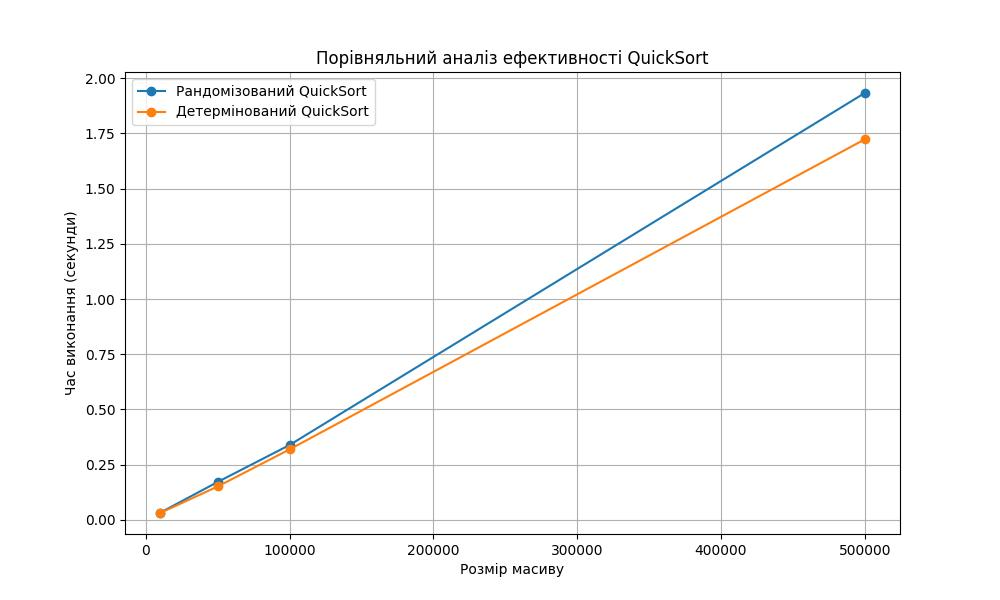

# Порівняння рандомізованого та детермінованого QuickSort

Рандомізований QuickSort демонструє більш повільну роботу, тоді як детермінований QuickSort лінійно залежить від розміру масиву.
На мою думку це викликано наступним:
1. генерується масив, де єлементи не відсортовані, и ця особливість - рівномірна по встому масиву.
2. на моєму досить слабкому ПК, операція пошуку рандомного елементу для розбиття масиву займає досить багато процесорного часу.